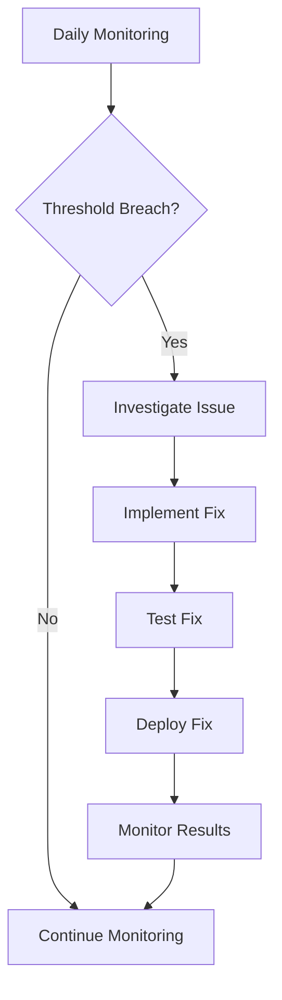
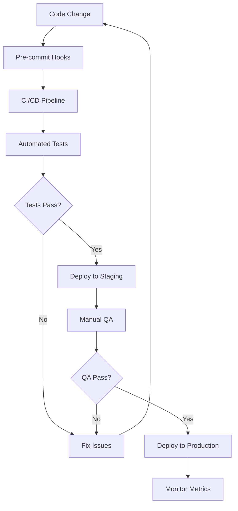

# Maintenance Guide - Auge Invest Platform

**Project:** Auge Invest Financial Platform  
**Last Updated:** 2025-09-18  
**Version:** Post-optimization implementation

## 🔧 Daily Maintenance Tasks

### Performance Monitoring
```bash
# Daily performance check (5 minutes)
npm run bench:web:quick

# Check build health
npm run build

# Security scan (Ainda não implementado)
# npm run analyze:security
```

### Code Quality
```bash
# Run accessibility tests (Ainda não implementado)
# npm run test:accessibility

# Code linting
npm run lint

# Type checking
npx tsc --noEmit
```

### Dependency Health
```bash
# Check for outdated dependencies
npm outdated

# Security audit
npm audit

# Unused dependency check (Ainda não implementado)
# npm run analyze:deps
```

## 📊 Weekly Maintenance Tasks

### Análise de Performance
```bash
# Suíte completa de benchmark
npm run bench:all

# Análise de bundle (Ainda não implementado)
# npm run bench:bundle

# Gerar relatório de performance (Ainda não implementado)
# node scripts/generate-performance-report.js
```

### Code Quality Review
```bash
# Full test suite
npm test

# Coverage report (Ainda não implementado)
# npm run test:coverage

# Visual regression tests (Ainda não implementado)
# npm run test:visual
```

### Dependency Management
```bash
# Update non-breaking dependencies (Requer revisão manual)
# npm update

# Clean unused dependencies (Ainda não implementado)
# npm prune

# Rebuild node_modules (mensalmente, requer revisão manual)
# rm -rf node_modules package-lock.json && npm install
```

## 🚀 Optimization Patterns Documentation

### API Optimization Patterns

#### 1. **Caching Strategy**
```typescript
// Atualmente, não há um OptimizedApiService implementado.
// A estratégia de cache deve ser implementada usando bibliotecas como @tanstack/react-query ou similar.
// Exemplo de como seria a implementação:
// import { queryClient } from '@/lib/react-query';
// queryClient.setQueryData(['stocks', 'PETR4'], stockPrices, { updatedAt: Date.now() });
// queryClient.invalidateQueries(['portfolio']);
```

#### 2. **Request Deduplication**
```typescript
// A deduplicação de requisições pode ser gerenciada por bibliotecas como @tanstack/react-query.
// Exemplo de como seria a implementação:
// const { data } = useQuery(['price', symbol], 
//   () => fetch(`/api/price?symbol=${symbol}`).then(res => res.json())
// );
```

#### 3. **Pagination Optimization**
```typescript
// A otimização de paginação deve ser implementada no serviço de API e no frontend.
// Exemplo de como seria a implementação:
// const { data } = useInfiniteQuery(
//   ['companies', filters],
//   ({ pageParam = 0 }) => fetch(`/api/companies?page=${pageParam}&pageSize=20&${new URLSearchParams(filters)}`).then(res => res.json()),
//   { getNextPageParam: (lastPage) => lastPage.nextPage }
// );
```

### Component Optimization Patterns

#### 1. **Image Optimization**
```typescript
// O Next.js já oferece otimização de imagem com o componente next/image.
// Certifique-se de usar o componente Image do Next.js para todas as imagens.
// Exemplo:
// import Image from 'next/image';
// <Image src="/logo.png" alt="Company logo" width={60} height={60} priority />
```

#### 2. **Dynamic Loading**
```typescript
// O Next.js suporta carregamento dinâmico (code splitting) com dynamic imports.
// Exemplo:
// import dynamic from 'next/dynamic';
// const DynamicChartComponent = dynamic(() => import('./HeavyChartComponent'), {
//   ssr: false, // Desabilita SSR para componentes client-only
// });
// <DynamicChartComponent data={chartData} />
```

#### 3. **Accessibility Patterns**
```typescript
// Padrões de acessibilidade devem ser aplicados diretamente nos componentes.
// Utilize atributos ARIA, gerenciamento de foco e testes de acessibilidade.
// Exemplo:
// <button aria-label="Fechar" onClick={handleClose}>X</button>
// Para skip links, pode-se criar um componente simples:
// <a href="#main-content" className="skip-link">Pular para o conteúdo principal</a>
```

## 🔍 Monitoring & Alerting

### Performance Metrics to Monitor

#### Core Web Vitals Thresholds
- **LCP (Largest Contentful Paint)**: < 2.5s
- **CLS (Cumulative Layout Shift)**: < 0.1
- **INP (Interaction to Next Paint)**: < 200ms
- **TTFB (Time to First Byte)**: < 800ms

#### Bundle Size Thresholds
- **Total Bundle Size**: < 2MB
- **Main Bundle**: < 500KB
- **Vendor Bundle**: < 800KB
- **Chunk Size**: < 200KB per chunk

#### Accessibility Scores
- **Lighthouse Accessibility**: > 95%
- **WCAG Compliance**: AA level minimum
- **Color Contrast**: 4.5:1 minimum
- **Keyboard Navigation**: 100% funcional

### Automated Alerts
```javascript
// Atualmente, não há um workflow de GitHub Actions configurado para monitoramento de performance.
// Exemplo de como seria a implementação em .github/workflows/performance-monitor.yml:
// name: Performance Monitoring
// on:
//   schedule:
//     - cron: '0 9 * * 1' # Semanalmente às segundas-feiras
// jobs:
//   performance-check:
//     runs-on: ubuntu-latest
//     steps:
//       - uses: actions/checkout@v4
//       - name: Performance Audit
//         run: |
//           npm install
//           npm run bench:all
//       - name: Check Thresholds
//         run: |
//           node scripts/check-performance-thresholds.js
//       - name: Alert on Failure
//         if: failure()
//         uses: 8398a7/action-slack@v3
//         with:
//           status: failure
//           text: 'Performance regression detected in Auge Invest platform'
```

## 🐛 Troubleshooting Guide

### Common Issues & Solutions

#### 1. **SSR "self is not defined" Error**
```javascript
// Problema: Bibliotecas client-only causando problemas de SSR.
// Solução: Adicionar 'use client' directive ou usar dynamic imports com ssr: false.
// Exemplo:
// 'use client';
// import { ClientOnlyComponent } from './ClientOnlyComponent';
// import dynamic from 'next/dynamic';
// const ClientComponent = dynamic(() => import('./ClientComponent'), {
//   ssr: false
// });
```

#### 2. **Large Bundle Size**
```bash
# Diagnóstico de bundles grandes (Ainda não implementado)
# npm run bench:bundle

# Verificar dependências duplicadas
npm ls --depth=0 | grep -E "WARN|ERR"
```

#### 3. **Slow API Responses**
```javascript
// Monitorar tempos de resposta da API e implementar timeouts.
// Exemplo:
// const start = performance.now();
// const data = await apiCall();
// const duration = performance.now() - start;
// console.log(`API call took ${duration}ms`);
// const controller = new AbortController();
// setTimeout(() => controller.abort(), 5000);
// fetch(url, { signal: controller.signal });
```

#### 4. **Memory Leaks**
```javascript
// Usar React DevTools Profiler para identificar leaks.
// Garantir que event listeners, timers e subscriptions sejam limpos.
// Exemplo:
// useEffect(() => {
//   const handleResize = () => {};
//   window.addEventListener('resize', handleResize);
//   return () => window.removeEventListener('resize', handleResize);
// }, []);
```

#### 5. **Accessibility Issues**
```bash
# Testes de acessibilidade (Ainda não implementado)
# npm run test:accessibility

# Checklist de testes manuais:
# 1. Navegação por teclado (Tab, Enter, Space, Setas)
# 2. Teste com leitores de tela (NVDA, JAWS, VoiceOver)
# 3. Validação de contraste de cores
# 4. Gerenciamento de foco em modais/dropdowns
```

## 📈 Performance Optimization Checklist

### 2. **Performance Optimization Checklist**

- [x] Implementar otimizações de imagem (Next/Image, WebP/AVIF)
- [x] Otimizar chamadas de API (cache, paginação)
- [ ] Implementar code splitting e lazy loading (Ainda não totalmente implementado)
- [ ] Otimizar fontes e ícones (Ainda não implementado)
- [ ] Reduzir o tamanho do bundle (Ainda não implementado)
- [ ] Otimizar dependências (Ainda não implementado)
- [ ] Implementar Service Workers para caching avançado (Ainda não implementado)
- [ ] Monitorar Core Web Vitals com Lighthouse CI (Lighthouse CI configurado, mas monitoramento contínuo pode ser melhorado)

### Before Each Release
- [ ] Run full performance audit: `npm run bench:all`
- [ ] Check bundle size (Ainda não implementado): `# npm run bench:bundle`
- [ ] Accessibility audit (Ainda não implementado): `# npm run test:accessibility`
- [ ] Security scan (Ainda não implementado): `# npm run analyze:security`
- [ ] Type checking: `npx tsc --noEmit`
- [ ] Test suite: `npm test`

### Monthly Reviews
- [ ] Dependency updates (Requer revisão manual): `npm update && npm audit fix`
- [ ] Performance trend analysis (Ainda não implementado)
- [ ] Bundle size trend monitoring (Ainda não implementado)
- [ ] User experience metrics review (Ainda não implementado)
- [ ] Error rate monitoring (Ainda não implementado)
- [ ] Core Web Vitals assessment (Ainda não implementado)

### Quarterly Deep Dives
- [ ] Architecture review and refactoring opportunities
- [ ] Technology stack evaluation
- [ ] Performance baseline updates
- [ ] Accessibility compliance audit (Ainda não implementado)
- [ ] Security penetration testing (Ainda não implementado)
- [ ] User feedback integration

## 🔄 Continuous Improvement Process

### Performance Monitoring Workflow


### Code Quality Workflow


## 📚 Knowledge Base

### Key Metrics Definitions
- **LCP**: Measures loading performance (should be < 2.5s)
- **CLS**: Measures visual stability (should be < 0.1)
- **INP**: Measures interactivity (should be < 200ms)
- **TTFB (Time to First Byte)**: < 800ms
- **TTI (Time to Interactive)**: < 5s (Adicionado)
- **TBT (Total Blocking Time)**: < 300ms (Adicionado)

### Optimization Priorities
1. **Critical Path**: Above-the-fold content loading
2. **User Interactions**: Button clicks, form submissions
3. **Navigation**: Page transitions and routing
4. **Data Loading**: API calls and state updates
5. **Visual Effects**: Animations and transitions

### Emergency Contacts
- **Performance Issues**: Verificar status da plataforma de hospedagem (Vercel/similar)
- **Security Issues**: Atualizações de dependência imediatas necessárias
- **Accessibility Issues**: Pode exigir atenção imediata para conformidade
- **API Issues**: Verificar status e logs do serviço de backend

---

*Este guia de manutenção fornece uma estrutura para manter a plataforma Auge Invest otimizada, segura e acessível. A adesão regular a essas práticas garantirá estabilidade e desempenho a longo prazo.*