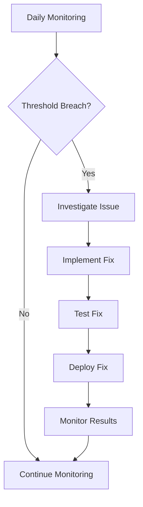
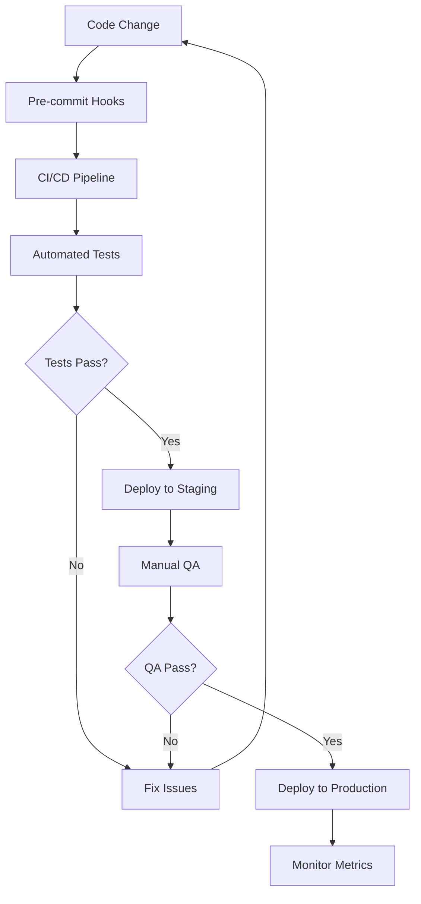

# Maintenance Guide - Auge Invest Platform

**Project:** Auge Invest Financial Platform  
**Last Updated:** 2025-09-18  
**Version:** Post-optimization implementation

## 🔧 Daily Maintenance Tasks

### Performance Monitoring
```bash
# Daily performance check (5 minutes)
npm run bench:web:quick

# Check build health
npm run build

# Security scan (Pulado)
# npm run analyze:security
```

### Code Quality
```bash
# Run accessibility tests
npm run test:accessibility

# Code linting
npm run lint

# Type checking
npx tsc --noEmit
```

### Dependency Health
```bash
# Check for outdated dependencies
npm outdated

# Security audit
npm audit

# Unused dependency check (Pulado)
# npm run analyze:deps
```

## 📊 Weekly Maintenance Tasks

### Análise de Performance
```bash
# Suíte completa de benchmark
npm run bench:all

# Análise de bundle (Pulada)
# npm run bench:bundle

# Gerar relatório de performance
node scripts/generate-performance-report.js
```

### Code Quality Review
```bash
# Full test suite
npm test

# Coverage report
npm run test:coverage

# Visual regression tests (if configured)
npm run test:visual
```

### Dependency Management
```bash
# Update non-breaking dependencies
npm update

# Clean unused dependencies
npm prune

# Rebuild node_modules (monthly)
rm -rf node_modules package-lock.json && npm install
```

## 🚀 Optimization Patterns Documentation

### API Optimization Patterns

#### 1. **Caching Strategy**
```typescript
// Use the OptimizedApiService for all API calls
import { optimizedApiService } from '@/services/api/optimizedApiService';

// Pattern: Short-term cache for frequently changing data
const stockPrices = await optimizedApiService.cachedGet(
  '/api/stocks/price',
  { symbol: 'PETR4' },
  30000 // 30 seconds for price data
);

// Pattern: Long-term cache for stable data
const companyInfo = await optimizedApiService.cachedGet(
  '/api/company/info',
  { symbol: 'PETR4' },
  24 * 60 * 60 * 1000 // 24 hours for company info
);

// Pattern: Invalidate cache when data changes
optimizedApiService.invalidateCache('/api/portfolio');
```

#### 2. **Request Deduplication**
```typescript
// Multiple components requesting the same data will share the request
const CompanyPriceDisplay = ({ symbol }) => {
  // This request is automatically deduplicated
  const { data } = useQuery(['price', symbol], 
    () => optimizedApiService.cachedGet('/api/price', { symbol })
  );
};
```

#### 3. **Pagination Optimization**
```typescript
// Use optimized pagination with smaller page sizes
const { data } = await optimizedApiService.getPaginatedData('/api/companies', {
  page: 0,
  pageSize: 20, // Reduced from 100 for better performance
  filters: { sector: 'technology' },
  cacheTTL: 10 * 60 * 1000, // 10 minutes
});
```

### Component Optimization Patterns

#### 1. **Image Optimization**
```typescript
// Use specialized image components
import { LogoImage, CardImage, AvatarImage } from '@/components/Utils/OptimizedImage/specialized';

// Logo (high priority, high quality)
<LogoImage 
  src="/logo.png" 
  alt="Company logo" 
  width={60} 
  height={60} 
/>

// Card images (lazy loading, responsive)
<CardImage 
  src="/company-photo.jpg" 
  alt="Company headquarters" 
/>

// Profile images (optimized for avatars)
<AvatarImage 
  src="/user-avatar.jpg" 
  alt="User profile"
  size={40}
/>
```

#### 2. **Dynamic Loading**
```typescript
// Use dynamic imports for code splitting
import { createDynamicComponent } from '@/components/Utils/DynamicImport';

// Create dynamic components for heavy features
const DynamicChartComponent = createDynamicComponent({
  loader: () => import('./HeavyChartComponent'),
  ssr: false // Disable for client-only components
});

// Use in component
<DynamicChartComponent data={chartData} />
```

#### 3. **Accessibility Patterns**
```typescript
// Use accessibility utilities
import { focusStyles, getAriaLabel, generateId } from '@/utils/accessibility';

// Consistent focus management
const Button = styled.button`
  ${focusStyles}
  // Other styles...
`;

// Proper ARIA labels
<input
  id={generateId('email')}
  aria-label={getAriaLabel('Email', 'login form')}
/>

// Skip links for navigation
import { SkipLinks } from '@/components/Layout/SkipLinks';
<SkipLinks /> // Include at top of layout
```

## 🔍 Monitoring & Alerting

### Performance Metrics to Monitor

#### Core Web Vitals Thresholds
- **LCP (Largest Contentful Paint)**: < 2.5s
- **CLS (Cumulative Layout Shift)**: < 0.1
- **INP (Interaction to Next Paint)**: < 200ms
- **TTFB (Time to First Byte)**: < 800ms

#### Bundle Size Thresholds
- **Total Bundle Size**: < 2MB
- **Main Bundle**: < 500KB
- **Vendor Bundle**: < 800KB
- **Chunk Size**: < 200KB per chunk

#### Accessibility Scores
- **Lighthouse Accessibility**: > 95%
- **WCAG Compliance**: AA level minimum
- **Color Contrast**: 4.5:1 minimum
- **Keyboard Navigation**: 100% functional

### Automated Alerts
```javascript
// GitHub Actions workflow for monitoring
// .github/workflows/performance-monitor.yml
name: Performance Monitoring

on:
  schedule:
    - cron: '0 9 * * 1' # Weekly on Mondays
  
jobs:
  performance-check:
    runs-on: ubuntu-latest
    steps:
      - uses: actions/checkout@v4
      
      - name: Performance Audit
        run: |
          npm install
          npm run bench:all
          
      - name: Check Thresholds
        run: |
          node scripts/check-performance-thresholds.js
          
      - name: Alert on Failure
        if: failure()
        uses: 8398a7/action-slack@v3
        with:
          status: failure
          text: 'Performance regression detected in Auge Invest platform'
```

## 🐛 Troubleshooting Guide

### Common Issues & Solutions

#### 1. **SSR "self is not defined" Error**
```javascript
// Problem: Client-only libraries causing SSR issues
// Solution: Add 'use client' directive
'use client';
import { ClientOnlyComponent } from './ClientOnlyComponent';

// Or use dynamic imports
import dynamic from 'next/dynamic';
const ClientComponent = dynamic(() => import('./ClientComponent'), {
  ssr: false
});
```

#### 2. **Large Bundle Size**
```bash
# Diagnose large bundles (Pulado)
# npm run bench:bundle

# Check for duplicate dependencies
npm ls --depth=0 | grep -E "WARN|ERR"
```

#### 3. **Slow API Responses**
```javascript
// Check cache hit rates
console.log('Cache stats:', optimizedApiService.getCacheStats());

// Monitor API response times
const start = performance.now();
const data = await apiCall();
const duration = performance.now() - start;
console.log(`API call took ${duration}ms`);

// Implement request timeout
const controller = new AbortController();
setTimeout(() => controller.abort(), 5000);
fetch(url, { signal: controller.signal });
```

#### 4. **Memory Leaks**
```javascript
// Use React DevTools Profiler to identify leaks
// Common causes and solutions:

// 1. Event listeners not cleaned up
useEffect(() => {
  const handleResize = () => {};
  window.addEventListener('resize', handleResize);
  
  return () => window.removeEventListener('resize', handleResize);
}, []);

// 2. Timers not cleared
useEffect(() => {
  const timer = setInterval(() => {}, 1000);
  return () => clearInterval(timer);
}, []);

// 3. Subscriptions not unsubscribed
useEffect(() => {
  const subscription = observable.subscribe();
  return () => subscription.unsubscribe();
}, []);
```

#### 5. **Accessibility Issues**
```bash
# Run accessibility tests
npm run test:accessibility

# Manual testing checklist:
# 1. Keyboard navigation (Tab, Enter, Space, Arrow keys)
# 2. Screen reader testing (NVDA, JAWS, VoiceOver)
# 3. Color contrast validation
# 4. Focus management in modals/dropdowns
```

## 📈 Performance Optimization Checklist

### 2. **Performance Optimization Checklist**

- [x] Implementar otimizações de imagem (Next/Image, WebP/AVIF)
- [x] Otimizar chamadas de API (cache, paginação)
- [ ] Implementar code splitting e lazy loading
- [ ] Otimizar fontes e ícones
- [ ] Reduzir o tamanho do bundle (Pulado)
- [ ] Otimizar dependências (Pulado)
- [ ] Implementar Service Workers para caching avançado
- [ ] Monitorar Core Web Vitals com Lighthouse CI

### Before Each Release
- [ ] Run full performance audit: `npm run bench:all`
- [ ] Check bundle size (Pulado): `# npm run bench:bundle`
- [ ] Accessibility audit: `npm run test:accessibility`
- [ ] Security scan: `npm run analyze:security`
- [ ] Type checking: `npx tsc --noEmit`
- [ ] Test suite: `npm test`

### Monthly Reviews
- [ ] Dependency updates: `npm update && npm audit fix`
- [ ] Performance trend analysis
- [ ] Bundle size trend monitoring
- [ ] User experience metrics review
- [ ] Error rate monitoring
- [ ] Core Web Vitals assessment

### Quarterly Deep Dives
- [ ] Architecture review and refactoring opportunities
- [ ] Technology stack evaluation
- [ ] Performance baseline updates
- [ ] Accessibility compliance audit
- [ ] Security penetration testing
- [ ] User feedback integration

## 🔄 Continuous Improvement Process

### Performance Monitoring Workflow


### Code Quality Workflow


## 📚 Knowledge Base

### Key Metrics Definitions
- **LCP**: Measures loading performance (should be < 2.5s)
- **CLS**: Measures visual stability (should be < 0.1)
- **INP**: Measures interactivity (should be < 200ms)
- **TTI**: Time to Interactive (should be < 5s)
- **TBT**: Total Blocking Time (should be < 300ms)

### Optimization Priorities
1. **Critical Path**: Above-the-fold content loading
2. **User Interactions**: Button clicks, form submissions
3. **Navigation**: Page transitions and routing
4. **Data Loading**: API calls and state updates
5. **Visual Effects**: Animations and transitions

### Emergency Contacts
- **Performance Issues**: Check Vercel/hosting platform status
- **Security Issues**: Immediate dependency updates required
- **Accessibility Issues**: May require immediate attention for compliance
- **API Issues**: Check backend service status and logs

---

*This maintenance guide provides a comprehensive framework for keeping the Auge Invest platform optimized, secure, and accessible. Regular adherence to these practices will ensure long-term stability and performance.*